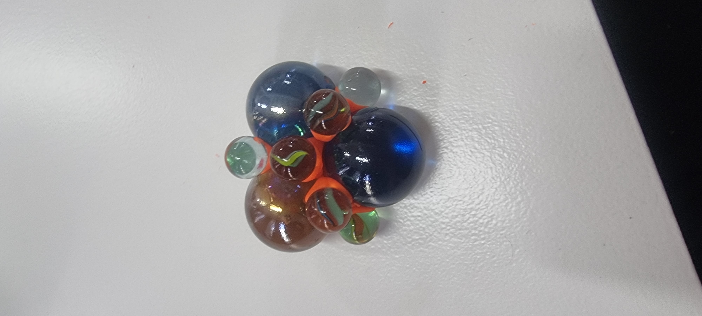

For the beginning of the design studio, we learned about the value of prototyping, different methods, and objectives of prototyping based on the First-Person Design method, where the designer immerses themselves in the environment they want to influence

As a designer, I already have experience with prototypes, but for the coming year, I would like to integrate this practice with more advanced technologies such as augmented reality or artificial intelligence

## Interventention 

**Video**

<iframe src="https://docs.google.com/presentation/d/e/2PACX-1vRH93TjfsVeJkfFDJ7kdPQvJPLv6tMQf4BsuTjyuijBOe6p-MTd6TW_dI7TYEycupbWWzxdXxNgLFqD/embed?start=false&loop=false&delayms=30000" frameborder="0" width="960" height="569" allowfullscreen="true" mozallowfullscreen="true" webkitallowfullscreen="true"></iframe>

**Miro Board**

<iframe width="768" height="432" src="https://miro.com/app/live-embed/uXjVNXDWCIM=/?moveToViewport=-11937,-6340,24480,14095&embedId=919132480296" frameborder="0" scrolling="no" allow="fullscreen; clipboard-read; clipboard-write" allowfullscreen></iframe>

**Reflections**

During the intervention, in an unconscious way we did a  celebration with a theme. We took advantage of Everardo's birthday to organize it and observed how it sparked dynamics, conversation topics, attracted attention, and prompted people to take photos. What we didn't anticipate was that some individuals did not take pictures and continued having regular conversations with other guests

